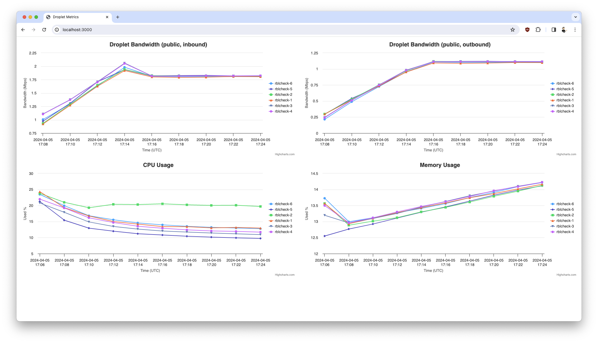

# Droplet Metrics Dashboard

Use DigitalOcean's [Public API](https://docs.digitalocean.com/reference/api/api-reference/) to fetch metrics for [tagged droplets](https://www.digitalocean.com/blog/droplet-tagging-organize-your-infrastructure), using [curl](https://curl.se/) and [jq](https://jqlang.github.io/jq/tutorial/):

```bash
TAG_NAME="wibble" DIGITALOCEAN_TOKEN="[REDACTED]" ./metrics.sh
```

Serve fetched metrics using a local http server ([Caddy](https://caddyserver.com/docs/)), rendered into graphs using [Highcharts](https://www.highcharts.com/docs/chart-and-series-types/line-chart):

```bash
./serve.sh
```

View your collected metrics at http://localhost:3000/

> [!TIP]
> If you would like to avoid fetching metrics with curl and jq you may be interested in the [nocache](https://github.com/digitalocean-labs/droplet-metrics-dashboard/tree/nocache) branch that uses Caddy server's reverse-proxy capabilities to fetch metrics directly from DigitalOcean's Public API.

## Example


